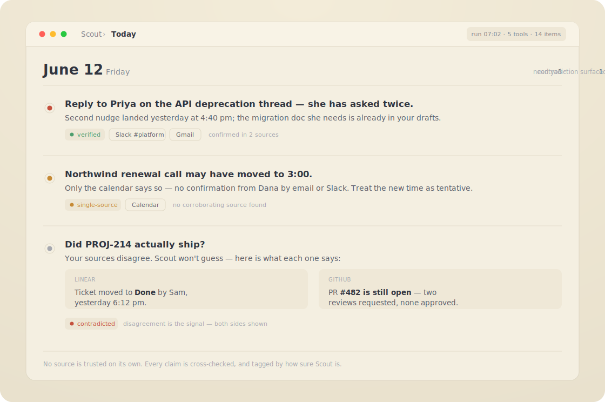

# Scout

> **The autonomous daily briefing that cross-checks all your work tools — so nothing falls through the cracks, and you can trust what it surfaces.**

<p align="center">
  
</p>

Scout runs unattended as scheduled [Claude Code](https://claude.com/claude-code) sessions. It reads Slack, Calendar, Gmail, Linear, GitHub, and meeting transcripts; cross-checks every finding against the others; and each morning hands you a short list of what actually needs you — every item tagged by how many sources confirm it. What you get is a persistent, interlinked knowledge base you can browse in Obsidian, and a daily action list you can trust *because you can see its work*.

You shouldn't have to manually reconcile what happened across seven tools yesterday, what's still pending from last week, or what changed while you were in meetings. Scout does it — and when your tools disagree, it flags the contradiction instead of quietly picking a side.

## Why Scout is different

Readable-markdown memory, scheduled runs, and a self-improvement loop are table stakes now — every serious agent has them. Scout's difference is what it does *before* it tells you anything:

- **It cross-checks.** No single tool is treated as the truth. A calendar invite is verified against the transcript; a Linear ticket against the PR; an email against Slack. Claims only one source supports are flagged, not asserted.
- **It shows its confidence.** Every entry is tagged — `verified` (2+ sources), `single-source`, `unverified`, `stale`, or `contradicted`. You always know how much weight to give it.
- **It's structured, not just stored.** A formal knowledge graph — typed people, projects, tasks, and relationships you can actually query — not a flat pile of notes.
- **It surfaces disagreement.** When your sources conflict, that contradiction *is* the signal. Scout shows you both sides instead of guessing which is right.

Most assistants summarize. Scout corroborates — and that's the difference between output you skim and output you act on.

## Scout runs — and improves — itself

Most "AI memory" tools are static: they store what you tell them and answer when asked. Scout is the opposite — a system that operates and improves *on its own*, between your check-ins. This is the part other tools don't have, and it's why Scout gets **more reliable the longer it runs.**

### It keeps a model of its own mistakes

When Scout gets something wrong and you flag it (a 👎 or a one-line correction on its summary), it records a numbered **mistake pattern**: the error type, the root cause, and the fix. Patterns track recurrence — and if one marked "fixed" happens again, it's flagged as a **regression** so it can't quietly rot. The fix is written back into Scout's own instructions, so that whole *class* of error gets rarer over time. (The author's live vault carries 100+ logged patterns.) This isn't a bug tracker; it's a self-model that makes Scout monotonically more reliable.

### It rewrites its own instructions — in the open

Scout doesn't wait for a maintainer to ship an update. Its nightly **Dreaming** session edits its own skill files directly for additive, feedback-aligned fixes, and files an **opt-out proposal** for anything larger (it applies after a few days unless you reject it). Every change is a separate git commit you can read and `git revert` — so the safety model is *transparency + reversibility*, not a checkpoint on every step. (Scout once proposed retiring its own approval gate because it was causing missed-update regressions; the author reviewed the proposal and approved it.)

### It drives its own roadmap

Scout keeps a **Wishlist** of improvements and works it down on its own — picking an item each evening, implementing it, shipping it, marking it done. Features Scout has built *for itself* this way include a native macOS Control Center app, a terminal action-items UI, and the Research session type. You aren't the only one filing feature requests.

### It goes and finds what it's missing

A **research queue** lets Scout expand its own knowledge between briefings — scoring which entities are stale or thin, rotating across your projects so it doesn't fixate on one, then digging via web search, docs, and your tools. Leave a note anywhere in the vault (an inline `//==<< … >>==//` comment) and the next run picks it up and prioritizes it.

### It asks you — sparingly — for what only you know

Scout can't see everything from your tools, so it occasionally surfaces a **targeted, low-stakes question** to fill a gap (always with a link and a one-line gist — never a notification firehose). Your answer is routed into the knowledge graph, and the same question is never asked twice.

### It refuses to guess about people

The most dangerous edit a knowledge system can make is mistaking one person for another. Scout **won't** merge, split, or rename a person on a single source — uncertain claims go to a **review queue** for you to confirm, rather than silently corrupting the graph.

Underneath all of it: **everything is git.** An ontology-validated knowledge graph (≈140 entities and ≈950 relationships in the author's live vault) with one commit per run — `briefing […]`, `consolidation […]`, `dreaming […]`, `research […]` — 800+ committed sessions and counting. The history *is* the system's memory of its own evolution: you can trace exactly what Scout changed, when, and why, and undo any of it.

## Install

```bash
curl -fsSL https://raw.githubusercontent.com/Raven-Scout/scout-plugin/main/install.sh | bash
```

Then open Claude Code and run `/scout-setup` to create your vault.

**Updating later:** run `/scout-update` — it refreshes the plugin and upgrades your vault (sidecar-safe).

## Quick Start

Scout is distributed as a Claude Code plugin via a built-in marketplace catalog (`.claude-plugin/marketplace.json`). Install it with:

```
/plugin marketplace add Raven-Scout/scout-plugin
/plugin install scout@scout-plugin
```

The first command registers this repo as a plugin marketplace; the second installs the `scout` plugin from it. After installing, the `/scout-*` commands and skills are available in every Claude Code session.

> **Other ways to install**
>
> - **One-off (no install):** `claude --plugin-dir /path/to/scout-plugin` loads the plugin for a single session without persisting it.
> - **From a local clone via marketplace:** `/plugin marketplace add /path/to/scout-plugin` (give it the directory containing `.claude-plugin/marketplace.json`).
>
> See [Discover and install plugins](https://code.claude.com/docs/en/discover-plugins) for the full Claude Code plugin documentation.

Then run `/scout-setup` in any Claude Code session. The setup wizard detects your connected tools (MCP connectors, `gh` CLI, local directories), collects your details (name, Slack ID, email), scaffolds the Scout directory with a knowledge graph ontology, assembles personalized skill files from phase modules matching your connectors, sets up budget tracking scripts, and configures scheduling. Done in under 5 minutes.

Check your installation at any time:

```
/scout-status
```

This shows connector health, schedule status, knowledge base freshness, knowledge graph health, budget tracking, and recent run history.

Launch sessions manually with skills:

```
/scout-briefing       # Morning briefing (or auto-detected mode)
/scout-consolidation  # Delta scan
/scout-dream          # Evening self-improvement
/scout-research       # Knowledge expansion
```

Or run interactive sessions in the current conversation:

```
/scout-work           # Walk through today's action items one at a time, approve each action
/scout-meta-review    # System-level audit — are sessions running, is the mistake audit trending well, are proposals flowing?
```

## How It Works

Six session types, split into **scheduled background sessions** (Briefing, Consolidation, Dreaming, Research) and **interactive conversation sessions** (Work, Meta Review):

### Morning Briefing (once per day, weekdays)

Full cold-start. Reads the entire knowledge base, queries every connected tool, cross-checks findings against each other, writes a fresh action items file, and updates the KB. Every action item must pass a multi-point cross-check before being committed — a meeting on your calendar is verified against transcripts, a Linear issue is verified against GitHub PRs, an email thread is verified against Slack messages. The briefing also queries the knowledge graph for personal tasks, deadline escalations, and birthday alerts. The briefing ends with a notification summarizing what needs your attention today.

### Weekend Briefing (Saturday/Sunday mornings)

A lighter version designed for weekends. Focuses on personal tasks from the knowledge graph, urgent work deadlines, Gmail, Calendar, and GitHub PR reviews. Skips deep Slack channel scanning and Granola transcript processing. Includes a Monday Preview section to help prep for the upcoming week.

### Consolidation (2-3x per day, weekdays)

Lightweight delta scan in six phases:

1. **What the user did** — Reads recent Claude Code sessions, sent messages, committed code, and updated issues to build a picture of your activity since the last run.
2. **What happened** — Queries all connectors for new events: messages, meetings, emails, issue updates, PR activity.
3. **Per-item reconciliation** — Walks each action item and reconciles it against fresh data from both phases. Updates, flags staleness, resolves contradictions. Also checks personal task completion signals (e.g., Gmail confirmations).
4. **KB audit** — Picks files for deep review. Every audit must pass a depth gate: "Would the user learn something new from what I touched?" Surface-level timestamp updates don't count. Includes GOOD vs BAD examples of audit work.
5. **Commit** — Stages all changes and commits with a descriptive message summarizing what was found.
6. **Notification** — Sends a summary of new findings, updated action items, and KB changes. Always mentions review queue items if any were added.

### Dreaming (evening, 1-2x)

Self-improvement loop:

1. **Feedback processing** — Reads reactions and replies on Scout's notifications. A thumbs-up on an action item confirms it was useful. A thumbs-down flags a pattern to avoid. Scans for inline comment markers (`//==<< comment >>==//`) embedded in KB files. These signals feed back into future runs via the mistake audit.
2. **KB deep work** — Runs knowledge graph integrity checks (ontology validation, personal task staleness detection). Scores KB files by staleness, importance, and interconnectedness. Picks the highest-value targets for deep improvement — restructuring, merging related notes, surfacing buried insights. Generates a Scout Digest summarizing all sessions and items needing user attention.
3. **Wishlist** — Checks the wishlist for user-requested features or improvements and maximizes progress — completing multiple sub-tasks or even multiple items per run.

### Research (opportunistic, off-peak)

Knowledge expansion:

1. **Target selection** — Checks the research queue for explicitly queued topics. If empty, scores KB entities by research need (recently interacted, thin context, high priority).
2. **Deep research** — Web search, documentation reading, GitHub activity scanning, internal tool queries. Different research depth guidelines for people, organizations, projects, and technologies.
3. **Knowledge integration** — Updates entity files, extends the knowledge graph with new relationships, creates new entity files for discovered entities. Validates against the ontology schema.
4. **Commit & notify** — Commits findings, updates the session log, sends a concise summary to the user.

### Work (interactive, user-triggered)

Runs in the current conversation instead of as a background process. Walks through today's action items one at a time — presenting each item with fresh context (latest PR state, last Slack reply, meeting conflicts), a recommended action, and a draft of any outbound message or command. Executes each item only with explicit approval (`do it`, `skip`, or a modification).

Commits land in the git log as `work [HH:MM]: <summary>`, distinguishing manual work from scheduled runs.

### Meta Review (interactive, diagnostic)

A system-level audit that sits above the individual session types. Does not read SKILL.md or DREAMING.md — instead it reviews the Scout system itself: are sessions actually running? Is the mistake audit trending better or worse? Are dreaming proposals flowing or clogged? Is the data-source coverage matrix consistent across session types? Writes a report to `knowledge-base/meta-review-YYYY-MM-DD.md`, applies low-risk quick fixes directly, and writes proposals for anything that needs judgment. Run weekly, or when something feels off.

Everything is a git repo. Every change Scout makes is committed with a descriptive message. The commit history is as much a part of the system as the files.

### Meeting Management

Scout tracks your recurring meetings in `meetings/`. Each meeting has:
- A **home file** with attendees, running themes, key decisions
- **Dated session files** that evolve through three phases: prep → notes → synthesis

Before each meeting, Scout generates a prep file with context from the last session, related project status, and suggested talking points. After meetings, it finds transcripts from Google Drive, synthesizes them with your manual notes, and propagates decisions and action items to project files.

### Inbox

`inbox.md` is your quick-capture file. Dump anything — meeting notes, reminders, ideas, personal tasks. Scout processes it every run and routes entries to the right place:
- Meeting notes → the relevant meeting's home file
- Action items → today's action items
- Personal tasks → knowledge graph entities
- Ideas → research queue

## Pre-Session Hooks

Scout's runner scripts call three shell hooks before launching Claude. Each hook writes a cache file into `.scout-cache/`, which the skill files read instead of running the same queries from inside the session. This trades a few seconds of shell work for a meaningful reduction in tool calls and tokens per session.

| Hook | Output | What it replaces |
|------|--------|-----------------|
| `hooks/kb-pre-filter.sh` | `.scout-cache/kb-filter.md` — KB files bucketed into stale / fresh / undated, with ages | Walking every KB file from inside the session to check "Last updated" dates |
| `scripts/pre-session-data.sh` | `.scout-cache/session-context.json` — recent git log, open PRs, PR review requests, KB file dates, open personal tasks | `git log`, `gh pr list`, `gh search prs`, ontology parser queries |
| `scripts/cc-session-cache.sh` | `.scout-cache/cc-sessions.md` — non-Scout Claude Code sessions from the last 24h: project paths, first prompts, files touched | Discovering + parsing `~/.claude/projects/*/*.jsonl` manually |

The `.scout-cache/` directory is gitignored — everything in it is recomputed on every run. If a hook fails, the runner script continues anyway and the skill falls back to live queries. Hooks never block a run.

## Supported Connectors

| Connector | What it provides | Required? |
|-----------|-----------------|-----------|
| Slack | Message monitoring, outbound tracking, feedback loop | No (enables dreaming feedback) |
| Google Calendar | Meeting context, scheduling verification | No |
| Gmail | Email tracking, sent mail verification | No |
| Linear | Issue tracking, status sync | No |
| GitHub (`gh` CLI) | PR tracking, commit monitoring, review requests | No |
| Granola | Meeting transcripts | No |
| Google Drive | Documents, meeting notes | No |
| Claude Code sessions | Work session history | No (auto-detected) |
Scout works with any subset of connectors. More connectors means richer cross-checking, but even a Calendar-only Scout is useful. The setup wizard detects what you have and assembles skill files accordingly.

## Knowledge Graph

Scout maintains a formal knowledge graph alongside the traditional markdown KB files. The ontology defines entity types (person, project, task, organization, technology, pet) with typed properties and relationships.

### Entity Files

Entity files are markdown files with YAML frontmatter:

```yaml
---
name: Jane Smith
type: person
email: jane@example.com
slack_id: U12345
role: Engineering Lead
relationships:
  - type: works_on
    target: "[[Project Alpha]]"
  - type: employed_by
    target: "[[Acme Corp]]"
---

# Jane Smith

Additional context about Jane...
```

### Parser

The knowledge graph parser (`knowledge-base/ontology/parser.py`) provides a CLI and Python API:

```bash
# Validate all entities against the schema
python knowledge-base/ontology/parser.py validate

# Show entity and relationship counts
python knowledge-base/ontology/parser.py stats

# Query entities by type
python knowledge-base/ontology/parser.py query --type task

# Look up a specific entity
python knowledge-base/ontology/parser.py entity --name "Jane Smith"

# Show relationships for an entity
python knowledge-base/ontology/parser.py related --name "Jane Smith"
```

### Personal Tasks

Personal task entities (`knowledge-base/personal/task-*.md`) track non-work items like vet appointments, taxes, and errands. They have special fields:

- `domain: personal` — marks them as personal vs work tasks
- `deadline` — date-based priority escalation (3 days out → urgent)
- `completion_signal: gmail_confirmation` — auto-resolve when a matching email appears
- `status: open/completed` — tracked across daily action items

## Budget System

Scout includes a budget tracking and rate limit detection system:

- **Budget check** (`scripts/budget-check.sh`) — runs before every session. Calculates rolling window cost, checks for recent rate limits, and skips sessions when budget is exhausted.
- **Session cost tracker** (`scripts/write-session-cost.sh`) — logs each session's cost as JSONL for analysis.
- **Rate limit detection** (`scripts/rate-limit-detect.sh`) — scans session logs for rate limit signals and triggers backoff.
- **Heartbeat** (`scripts/heartbeat.sh`) — polls every 30 minutes to trigger extra dreaming or research sessions when budget is available and work is pending.

## Architecture

Scout is built from **phase modules** — small, focused markdown files that each handle one aspect of the workflow. During setup, the wizard selects the modules matching your connected tools and assembles them into complete, self-contained skill files.

### Plugin structure

```
scout-plugin/
  .claude-plugin/
    plugin.json             -- Plugin manifest
    marketplace.json        -- Marketplace catalog (lets the repo install via /plugin marketplace add)
  commands/
    scout-setup.md          -- Interactive setup wizard
    scout-status.md         -- Dashboard command
    scout-work.md           -- Interactive work session (in-conversation)
    scout-meta-review.md    -- System-level diagnostic audit (in-conversation)
  skills/
    scout-briefing.md       -- Launch a briefing session (background)
    scout-consolidation.md  -- Launch a consolidation session (background)
    scout-dream.md          -- Launch a dreaming session (background)
    scout-research.md       -- Launch a research session (background)
  phases/
    core/                   -- Always included (git, KB management, action items, inbox, meetings)
    connectors/             -- One per tool (Slack, Calendar, Linear, etc.)
    modes/                  -- Dreaming-specific (feedback, KB deep work, wishlist)
    research/               -- Research session phases
  templates/
    hooks/                  -- Pre-session hooks (kb-pre-filter)
    scripts/                -- Budget tracking + pre-session data gathering
    action-items/           -- MD-to-HTML dashboard renderer + file watcher
    docs/wishlist/          -- Wishlist item directory seed (per-file)
    knowledge-base/         -- KB scaffold and ontology
    inbox.md.tmpl           -- Quick-capture template
    meetings/               -- Meeting registry template
    run-scout.sh.tmpl
    run-dreaming.sh.tmpl
    run-research.sh.tmpl
    scout-config.yaml.tmpl
    launchd-plist.tmpl
    cron-entry.tmpl
```

### What gets created in your Scout directory

```
~/Scout/
  SKILL.md                  -- Assembled skill file (briefing + consolidation)
  DREAMING.md               -- Assembled skill file (dreaming)
  RESEARCH.md               -- Assembled skill file (research)
  run-scout.sh              -- Briefing/consolidation runner (calls pre-session hooks)
  run-dreaming.sh           -- Dreaming runner (calls pre-session hooks)
  run-research.sh           -- Research runner
  scout-config.yaml         -- Your configuration
  inbox.md                  -- Quick-capture file (processed every run)
  meetings/                 -- Meeting registry + per-meeting folders (prep/notes/synthesis)
  dreaming-proposals.md     -- Proposal gate for skill improvements
  hooks/
    kb-pre-filter.sh        -- Pre-session: bucket KB files by staleness
  scripts/
    budget-check.sh         -- Pre-run budget verification
    write-session-cost.sh   -- Session cost logging
    rate-limit-detect.sh    -- Rate limit signal detection
    heartbeat.sh            -- Opportunistic session triggering
    pre-session-data.sh     -- Pre-session: gather git log, PRs, KB dates, tasks
    cc-session-cache.sh     -- Pre-session: summarize non-Scout CC sessions
  knowledge-base/           -- Your persistent knowledge base (Obsidian vault)
    ontology/
      schema.yaml           -- Knowledge graph schema
      parser.py             -- Query engine for the knowledge graph
      entities/             -- Organization entity files
    people/                 -- Person entity files
    personal/               -- Personal task and family entity files
    projects/               -- Project files
    research-queue/         -- Queued research topics (one file per topic)
    research-queue.md       -- Research run log (thin)
    scout-mistake-audit.md  -- Error-pattern log written by dreaming
    review-queue.md         -- Claims waiting on user verification
  action-items/             -- Daily action items
    archive/                -- Older-than-7-days action items
    meeting-prep/           -- Auto-generated meeting prep docs
    render.py               -- Optional MD → HTML dashboard
    watch.sh                -- Auto-re-render HTML on MD change (fswatch)
  docs/
    wishlist/               -- One file per wishlist item (state in frontmatter status:)
  .scout-cache/             -- Hook outputs (gitignored, regenerated every run)
  .scout-logs/              -- Run logs and usage-tracker.jsonl (gitignored)
```

The assembled skill files are self-contained — they don't reference the plugin at runtime. You can customize them freely. Run `/scout-setup` again to regenerate from the latest phase modules.

## Customization

- **Edit skill files directly**: The assembled `SKILL.md`, `DREAMING.md`, and `RESEARCH.md` are yours to modify. Add checks, remove sections, change wording — they're plain markdown.
- **Change schedule**: Edit the launchd plist or cron entries, or re-run `/scout-setup` to reconfigure timing.
- **Add KB files**: Create new project folders following the convention `projects/<name>/<name>.md`. Scout will pick them up on the next run.
- **Extend the ontology**: Add new entity types and relationships in `knowledge-base/ontology/schema.yaml`. The parser validates against this schema.
- **Queue research topics**: Add a file to `knowledge-base/research-queue/` (e.g. `knowledge-base/research-queue/<date>-<topic-slug>.md`) with frontmatter (`title`, `status: open`, `priority`, `date`) describing what to research. Scout picks it up during research sessions.
- **Adjust cross-checks**: The cross-check logic in `SKILL.md` scales with connectors — add or remove verification points as needed.
- **Re-assemble**: After plugin updates, run `/scout-setup` and choose Reassemble to regenerate skill files with new improvements while preserving your configuration.

## Design Philosophy

The principles that make Scout work:

### Source Equality

No single connector is treated as authoritative. A meeting transcript is a signal, not a fact. A Slack message is context, not ground truth. Everything gets verified against other sources before it becomes a KB entry or an action item.

### Verification Levels

KB content is tagged by confidence:

- No marker — verified by 2+ sources
- `[single-source]` — only one source, plausible but unverified
- `[unverified]` — mentioned but not corroborated
- `[stale]` — was accurate, hasn't been confirmed recently
- `[contradicted]` — sources disagree

This makes trust explicit. When you read the KB, you know exactly how much weight to give each piece of information.

### KB as Persistent Memory

The knowledge base isn't a log or a copy of your tools. It synthesizes information into a coherent picture — who's working on what, which projects are blocked, what decisions were made and why. Action items are ephemeral (regenerated each morning); the KB is permanent and evolving. The knowledge graph adds formal structure with typed entities and relationships queryable by the parser.

### Git as Foundation

Every change is committed. The history is the system's memory of its own evolution. Scout uses `git log` and `git diff` to detect what changed since the last run, avoid duplicate work, and provide an audit trail. If something goes wrong, you can always trace back to when and why.

### Feedback Loop

Scout sends notifications. You react with a thumbs-up or thumbs-down, or leave inline comments (`//==<< comment >>==//`) in KB files. Dreaming sessions process the feedback, identify patterns (action items that were always dismissed, KB entries that were always wrong), and feed those patterns into skill improvements. Future runs get better because past runs were evaluated.

### Depth Self-Check

Every KB audit must pass a gate: "Would the user learn something new from what I touched?" Touching a file to bump a timestamp doesn't count. Rewriting a paragraph to say the same thing in different words doesn't count. The audit must produce genuine insight or it doesn't get committed.

### Adaptive Cross-Checking

The more connectors you have, the more verification points each action item passes through. A 2-connector setup still produces useful results. A 7-connector setup produces thoroughly verified ones. The system adapts its verification depth to what's available rather than failing when a connector is missing.

### Budget-Aware Scheduling

The heartbeat system opportunistically triggers extra sessions (dreaming or research) when budget is available and work is pending, while the budget check prevents overspend. Rate limit detection triggers automatic backoff, and the usage tracker provides cost visibility.

## FAQ / Troubleshooting

**My scheduled runs aren't firing.**
On macOS, check `launchctl list | grep scout`. Make sure your machine is awake at scheduled times — launchd won't fire if the lid is closed. Verify the plist is loaded with `launchctl list`. Check logs in `.scout-logs/` for errors from the last attempted run.

**My runs keep getting skipped because of budget.**
If a session log ends with `=== Budget check: skipping this run ===`, the budget check is stopping it before Claude even starts. Diagnose with:

```
scoutctl budget check --verbose
```

This prints what you've spent in the current window and the threshold it's comparing against, e.g.:

```
[budget-check] budget OK — $4.10 spent (threshold: $16.88)
[budget-check] window: 3h, daily: $150.00, window budget: $18.75, skip at: $16.88
```

The threshold is derived from `daily_budget_estimate_usd` in `scout-config.yaml`:

- **window budget** = `daily_budget_estimate_usd` × (`rate_limit_window_hours` ÷ 24) — the spend allowed in one rolling window (default: $150 × 3/24 = $18.75)
- **skip at** = window budget × (`skip_threshold_pct` ÷ 100) — sessions are skipped once window spend crosses this (default: 90% = $16.88)

With sessions averaging ~$4 each, the default leaves room for ~4 sessions per 3-hour window. If your schedule packs more sessions into a window than that — or you simply want more headroom — raise `daily_budget_estimate_usd` (e.g. $150 → $200 lifts the skip threshold to $22.50). Re-run `scoutctl budget check --verbose` to confirm the new numbers. The change takes effect on the next scheduled run; no reassemble needed.

**A connector stopped working.**
Re-authenticate the MCP connector in Claude Code settings. Run `/scout-status` to see which tools are currently available and which are returning errors.

**The KB is getting stale.**
Check run logs in `.scout-logs/`. Verify your schedule is active with `launchctl list | grep scout` or by checking cron with `crontab -l`. Run `/scout-status` to see file freshness — it reports the last-modified time for every KB file.

**I want to add a new connector.**
Run `/scout-setup` and choose Reconfigure. The wizard will re-detect available tools and reassemble your skill files to include the new connector's phase modules.

**I want to customize the skill file.**
Edit `SKILL.md`, `DREAMING.md`, or `RESEARCH.md` directly in your Scout directory. Your changes persist until you explicitly run Reassemble from `/scout-setup`. The plugin never overwrites your skill files without asking.

**How do I queue research topics?**
Add a file to `knowledge-base/research-queue/` (e.g. `knowledge-base/research-queue/<date>-<topic-slug>.md`) with frontmatter (`title`, `status: open`, `priority`, `date`) describing what to research. Scout picks it up during the next research session.

**How do I add personal tasks?**
Create a file in `knowledge-base/personal/task-<name>.md` with YAML frontmatter including `type: task`, `domain: personal`, `status: open`, and optionally `deadline`, `priority`, and `completion_signal`. Scout will surface these in daily action items.

**Can I use this without Obsidian?**
Yes. The KB is just markdown files with `[[wikilinks]]` between them. Obsidian provides the best reading experience — you get a graph view of how projects, people, and channels connect — but any markdown viewer or text editor works fine.

**Can multiple people use Scout on the same team?**
Each person runs their own Scout instance with their own KB. Scout is designed around individual context — your meetings, your messages, your action items. Team-wide knowledge sharing happens through your normal tools; Scout helps each person stay on top of what matters to them.

**How do I update the plugin?**
Pull the latest version of the plugin repo. Then run `/scout-setup` and choose Reassemble to regenerate your skill files with the latest phase module improvements. Your configuration and KB are preserved.

**What about costs?**
Run `/scout-status` to see the budget tracking section. The usage tracker logs every session's cost. The budget check automatically skips sessions when the rolling-window spend crosses the skip threshold. To inspect or adjust the limits, see *"My runs keep getting skipped because of budget"* above — the key knobs are `daily_budget_estimate_usd`, `rate_limit_window_hours`, and `skip_threshold_pct` in `scout-config.yaml`.

## License & legal

Scout is open-source under the [MIT License](LICENSE).

- **[Privacy Policy](PRIVACY.md)** — Scout is local-first and collects nothing; your data stays on your machine. ([web version](https://raven-scout.github.io/scout-plugin/privacy.html))
- **[Terms of Use](TERMS.md)** — free, open-source, provided as-is. ([web version](https://raven-scout.github.io/scout-plugin/terms.html))
- **[Security Policy](https://github.com/Raven-Scout/.github/blob/main/SECURITY.md)** · **[Code of Conduct](https://github.com/Raven-Scout/.github/blob/main/CODE_OF_CONDUCT.md)**

Scout is an independent project and is not affiliated with, endorsed by, or sponsored by Anthropic, Microsoft, Keboola, or any other company.
